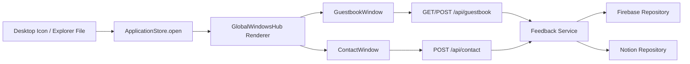

# Guestbook + Contact Design (Windows 98 Blog)

Date: 2026-02-23

## 1) Goal and Scope

- Add a public `Guestbook` so visitors can leave a trace.
- Add a private `Contact` channel for direct messages.
- Keep UX consistent with current Windows/App Explorer/Notepad style.
- Keep schema/API extensible for future post comments.

## 2) Windows 98 Style Interpretation

- Windows 98 did not have a built-in web guestbook feature.
- The closest era pattern was Address Book / Outlook Express + web forms.
- Recommended UX in this blog:

1. `Guestbook` window: public entries list + write form
2. `Contact` window: private message form with Address Book vibe

## 3) Architecture Diagram

Key points:

- Reuse existing window primitives (`Window`, `WindowMenuBar`, `WindowBody`, `WindowStatus`).
- Hide data source behind repository adapters for Firebase/Notion swap.
- Future comments can be added with minimal new domain code.

## 4) Integration Points in Current Codebase

App and window registry:

- `features/explorer/data/index.ts`: add app keys and app catalog entries
- `app/GlobalWindowsHub.tsx`: add window renderers
- `features/desktop/components/index.tsx`: connect desktop icon open behavior
- `features/fs/data/*.ts`: add explorer file items for guestbook/contact
- `features/explorer/hooks/useItemInteraction.ts`: add app branching for new windows

API routes:

- `app/api/guestbook/route.ts`
- `app/api/contact/route.ts`
- Optional future: `app/api/comments/route.ts`

UI components:

- `features/guestbook/components/GuestbookWindow.tsx`
- `features/contact/components/ContactWindow.tsx`
- `features/guestbook/components/GuestbookWriteForm.tsx`

Server domain/repository:

- `lib/server/feedback/types.ts`
- `lib/server/feedback/validation.ts`
- `lib/server/feedback/service.ts`
- `lib/server/feedback/repositories/firebase.ts`
- `lib/server/feedback/repositories/notion.ts`
- `lib/server/feedback/repositories/index.ts`

## 5) DB Schema

### 5.1 Common Entities (Recommended)

`guestbook_entries`

- `id`: string (ULID or UUID)
- `nickname`: string (2-24)
- `password_hash`: string
- `message`: string (1-500)
- `created_at`: timestamp
- `status`: enum (`published`, `hidden`, `spam`)
- `ip_hash`: string
- `user_agent`: string | null

`contact_messages`

- `id`: string
- `name`: string (2-40)
- `email`: string (required)
- `subject`: string (1-120)
- `message`: string (1-2000)
- `created_at`: timestamp
- `status`: enum (`new`, `read`, `replied`, `spam`, `archived`)
- `ip_hash`: string
- `user_agent`: string | null

Future `article_comments`

- `id`: string
- `article_page_id`: string
- `nickname`: string
- `message`: string
- `created_at`: timestamp
- `status`: enum (`published`, `hidden`, `spam`)
- `parent_comment_id`: string | null

### 5.2 Notion DB Mapping

Guestbook DB properties:

- `Nickname` (title)
- `Message` (rich text)
- `Status` (select)
- `CreatedAt` (date)
- `IpHash` (rich text)

Contact DB properties:

- `Subject` (title)
- `Name` (rich text)
- `Email` (email)
- `Message` (rich text)
- `Status` (select)
- `CreatedAt` (date)
- `IpHash` (rich text)

Note:

- Notion has write/query constraints for operational form traffic.

### 5.3 Firebase (Firestore) Mapping

Collections:

- `guestbook_entries/{id}`
- `contact_messages/{id}`
- `article_comments/{id}`

Recommended indexes:

- guestbook: `status + created_at(desc)`
- comments: `article_page_id + status + created_at(desc)`

## 6) API Spec

### 6.1 GET `/api/guestbook`

Query:

- `limit` (default 20, max 50)
- `cursor` (optional)

Response 200:

- `items`: GuestbookEntry[]
- `nextCursor`: string | null

### 6.2 POST `/api/guestbook`

Request body:

- `nickname`: string
- `password`: string
- `message`: string
- `website?`: string (honeypot; if set, treat as spam)

Validation:

- nickname 2-24
- password 4-64
- message 1-500

Response:

- 201 `{ id, createdAt }`
- 400 validation error
- 429 rate limited

### 6.3 PATCH/DELETE `/api/guestbook/{id}`

- `PATCH` body: `{ status: "hidden" | "published", password: string }`
- `DELETE` body: `{ password: string }`
- The server compares `password` hash with the stored `password_hash`.

### 6.4 POST `/api/contact`

Request body:

- `name`: string
- `email`: string
- `subject`: string
- `message`: string
- `website?`: string (honeypot)

Validation:

- name 2-40
- email basic RFC pattern
- subject 1-120
- message 1-2000

Response:

- 201 `{ id, createdAt }`
- 400 validation error
- 429 rate limited

### 6.5 Future Extension: GET/POST `/api/comments`

- `GET /api/comments?articlePageId={id}`
- `POST /api/comments` with `{ articlePageId, nickname, message, parentCommentId? }`

## 7) Security and Anti-Spam (MVP)

- Store hashed IP only (do not store raw IP).
- Per-minute rate limit:
- guestbook: 3 per IP
- contact: 2 per IP
- Honeypot field `website`
- Optional blocked-words filter
- Optional moderation mode via `status=pending`

## 8) Step-by-Step Delivery Plan

### Step 0. Storage Decision Gate

Recommended: `Firebase Firestore`

- Simpler writes, reads, pagination, and indexing.
- Notion is easier for manual admin but weaker as a form backend.

Decision options:

- Option A: Firebase primary + Notion adapter retained
- Option B: Notion-only MVP, then migrate to Firebase

### Step 1. Server Domain and Repository Layer

Tasks:

- Define feedback types and validators
- Define repository interfaces
- Implement firebase/notion adapters
- Add env-based repository resolver

Done criteria:

- API routes work without changing business logic when repository switches

### Step 2. Guestbook API + Window UI

Tasks:

- Build GET/POST `/api/guestbook`
- Build `GuestbookWindow` list + submit form
- Connect desktop/explorer entry

Done criteria:

- New entry appears after submit
- Error/loading states are visible in window UI

### Step 3. Contact API + Window UI

Tasks:

- Build POST `/api/contact`
- Build `ContactWindow` form + submit feedback state

Done criteria:

- Message is persisted
- Success/failure state is clearly shown

### Step 4. Operational Safeguards

Tasks:

- Add rate limit
- Add honeypot handling
- Add public/private status filtering

Done criteria:

- Excessive or bot-like requests are blocked

### Step 5. Comment-Ready Extension

Tasks:

- Add `/api/comments`
- Add comment panel in `ArticleViewer`
- Reuse guestbook/contact validation and form logic

Done criteria:

- Comment fetch/post works per article

## 9) Ticket Breakdown (Draft)

1. `FEED-01` Add app keys/catalog entries (`guestbook`, `contact`)
2. `FEED-02` Add GlobalWindowsHub renderers
3. `FEED-03` Add explorer FS items (`Guestbook.txt`, `Contact.msg`)
4. `FEED-04` Add feedback types/validation/repository interface
5. `FEED-05` Implement Firebase repository
6. `FEED-06` Implement Notion repository (optional)
7. `FEED-07` Implement GET/POST `/api/guestbook`
8. `FEED-08` Implement POST `/api/contact`
9. `FEED-09` Build Guestbook window UI
10. `FEED-10` Build Contact window UI
11. `FEED-11` Add rate limit + honeypot
12. `FEED-12` Add e2e/manual test scenarios

## 10) Acceptance Criteria

- Guestbook and Contact windows open from desktop/explorer.
- Guestbook entries persist across refresh.
- Contact messages are private (not publicly listed).
- Invalid inputs return 400.
- Excessive requests return 429.
- Comments can be added later with minimal reuse-friendly changes.
